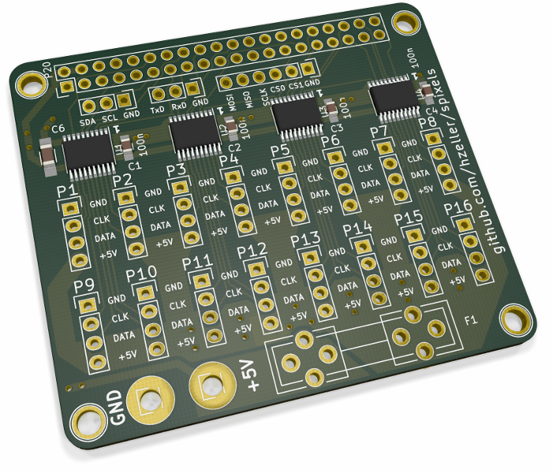

SPI Pixels - Control 16 LED strips at once
==========================================
http://spixels.org/

Parallely feeding 16 SPI LED strips with a Raspberry Pi.

This is the hardware and library separated out of the [FlaschenTaschen] project
to be used independently.

This provides a Raspberry Pi Adapter to connect up to 16 SPI-type LED strips
(such as **APA102**, **WS2801**, **LDP6803**), that are fed by the Raspberry Pi
in parallel for fast update rates.

The C++ library can be found in [include/](./include) and
[lib/](./lib), with examples in the, you guessed it,
[examples/](./examples) directory.

You find the board in the [hardware/](./hardware) directory.

The adpater is compatible with any Raspberry Pi with 40 GPIO pins, such as the
Pi 1 B+, Pi 2 or Pi 3.

Of course, you can use the MultiSPI thing for other simple devices

This is used in the [FlaschenTaschen] project, in which only 9 of the 16
connectors are used, one for each 'crate column'. The update rate with
WS2801 reaches 160fps!.

[FlaschenTaschen]: https://github.com/hzeller/flaschen-taschen

