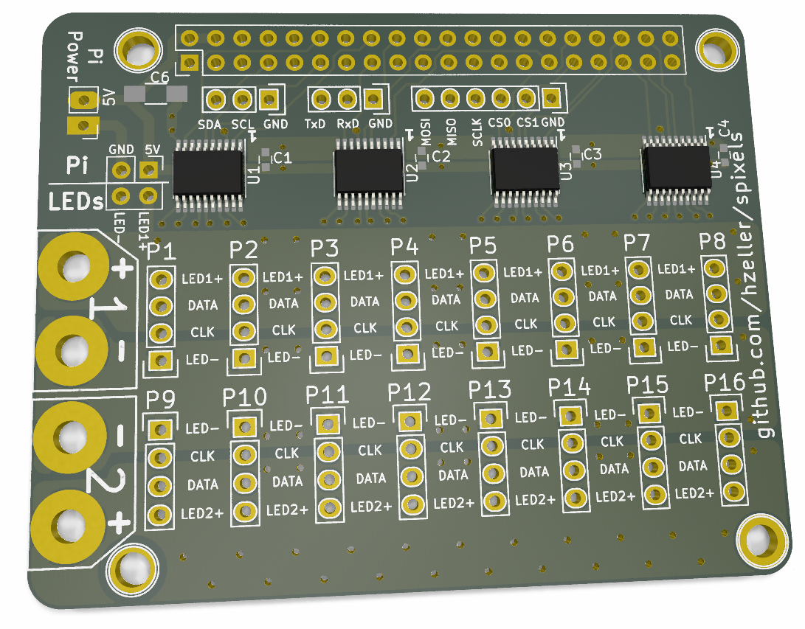
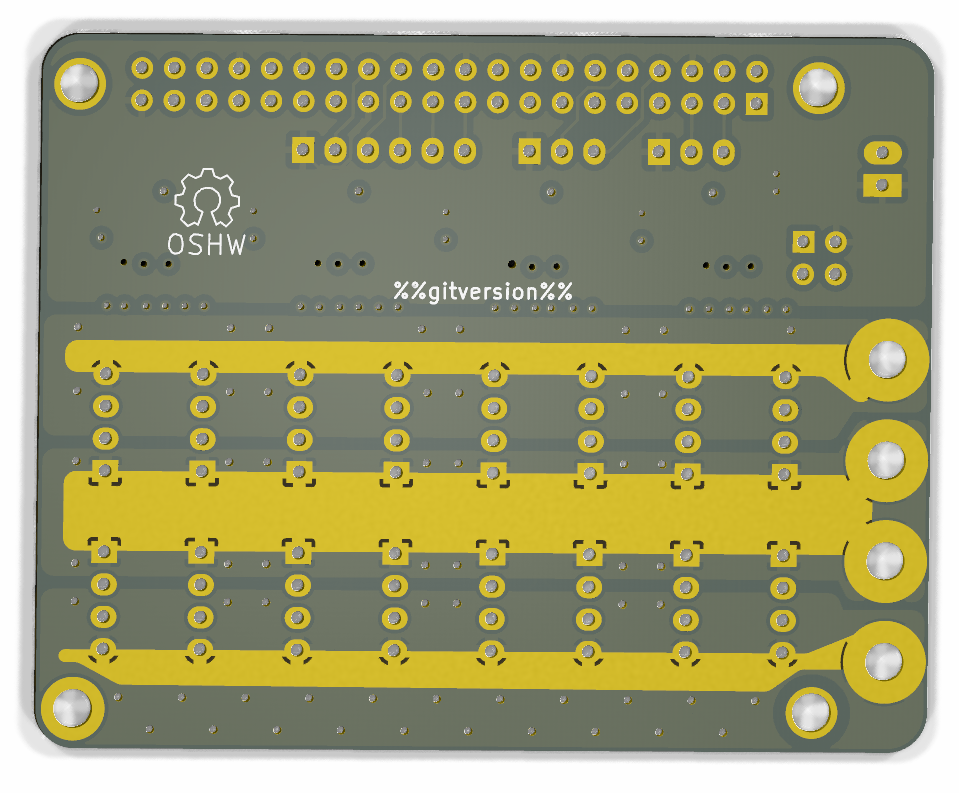

# High Current Spixel

Spixel board that allows two separate power supply inputs for 8 strands,
and heavy copper pour to drive current to these. The backside allows to
add additional power-carrying bars.

**NOTE** while wiring up the LED strips: the connections are inside out with
the negative power connection at the center of the board, followed by
clock, data, and positive connection towards the long edges of the board (this
is different from the wiring in the [low current board](../pi-adapter-16)).

The power rails are named `LED-` and `LED+` as this would be the typical
polarity configuration, but it also allows to wire them up with inverted
polarity if the LED strips need `[-,data,clock,+]`,

For correct operation, you need to connect whatever is `GND` on the LEDs with
`GND` on the Pi on the PI/LEDd jumper square on the left. In the common case
in which `LED-` is negative, it is just a straight wire accross.

It is also possible to power the Raspberry Pi from the top power rail
(as long as they are 5V) if you also connect the 5V from the rail with the
5V input of the Pi at that same jumper block.

The connection to the power rails and the LED strips need a lot of heat to
solder, in particular if you have 70μm (2oz) copper on there.
An inductive soldering iron is highly recommended.

